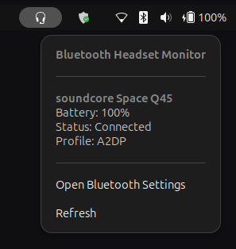

# Bluetooth Headset Monitor

Bluetooth Headset Monitor is a GNOME Shell extension that adds a headset indicator to the top panel only when at least one compatible Bluetooth audio device is connected. The popup menu gives quick access to live device information such as battery level, connection status, inferred audio profile, and optional advanced details.



> [!NOTE]
> The extension is built around BlueZ D-Bus signals instead of polling, so the UI updates when devices connect, disconnect, or change properties.

## Highlights

- Shows a panel icon only while compatible Bluetooth audio devices are connected.
- Detects audio devices through `org.bluez.Device1` and common Bluetooth audio service UUIDs.
- Reads battery percentage from `org.bluez.Battery1` when the device exposes it.
- Supports multiple connected headsets in the same popup menu.
- Shows per-device details including device name, battery percentage or `Unknown`, connected status, inferred profile label such as `A2DP`, `HFP`, or `HSP`, and optional Bluetooth address or RSSI signal strength.
- Includes quick actions for opening GNOME Bluetooth settings and manually refreshing device state.
- Sends notifications for device connected, device disconnected, and low battery threshold reached.
- Includes a preferences window for notification and detail-display settings.

## Supported GNOME Versions

The extension metadata currently targets GNOME Shell `46`, `47`, and `48`.

## How It Works

The extension connects to the system D-Bus and creates a BlueZ object manager for `org.bluez`. It watches object and property changes to keep an in-memory list of connected Bluetooth audio devices.

Only devices that satisfy both of these conditions are shown:

1. `Connected === true`
2. The device advertises at least one supported audio UUID

The current audio UUID filter includes:

- `00001108-0000-1000-8000-00805f9b34fb` (`HSP`)
- `0000110b-0000-1000-8000-00805f9b34fb` (`A2DP`)
- `0000110e-0000-1000-8000-00805f9b34fb` (`A2DP`)
- `0000111e-0000-1000-8000-00805f9b34fb` (`HFP`)

This keeps unrelated Bluetooth devices such as keyboards and mice out of the menu.

## Menu Behavior

When one or more supported devices are connected, the top-panel icon appears using `icons/audio-headset-symbolic.svg` when that file exists. If the file is missing, the extension falls back to the themed symbolic icon `audio-headphones-symbolic`.

The popup menu contains:

1. A static header: `Bluetooth Headset Monitor`
2. One entry per connected device
3. `Open Bluetooth Settings`
4. `Refresh`

Each device entry shows:

- Name
- `Battery: <percentage>%` or `Battery: Unknown`
- `Status: Connected`
- `Profile: <label>`
- `Address: <MAC>` when enabled in preferences
- `Signal: <RSSI> dBm` when enabled in preferences and available from BlueZ

When no supported device is connected, the indicator is hidden completely.

## Notifications

If notifications are enabled, the extension sends GNOME Shell notifications when:

- a new compatible device connects
- a previously connected compatible device disconnects
- a connected device battery falls to or below the configured threshold

Low-battery notifications are de-duplicated per connected device until the battery rises above the configured threshold or the device disconnects.

## Preferences

The preferences window currently exposes four settings through GSettings schema `org.gnome.shell.extensions.bluetooth-headset-monitor`:

- `show-notifications`: default `true`; controls connect, disconnect, and low-battery notifications.
- `battery-warning-threshold`: default `15`; valid range `1` to `100`.
- `show-rssi`: default `false`; shows signal strength in the menu when available.
- `show-device-address`: default `false`; shows the Bluetooth MAC address in the menu.

## Project Structure

```text
bluetooth-headset-monitor@dileepa.dev/
├── bluetoothManager.js
├── extension.js
├── icons/
│   └── audio-headset-symbolic.svg
├── metadata.json
├── prefs.js
├── schemas/
│   └── org.gnome.shell.extensions.bluetooth-headset-monitor.gschema.xml
├── stylesheet.css
└── ui/
    ├── deviceMenuItem.js
    └── panelIndicator.js
```

## Architecture Overview

### `bluetoothManager.js`

Responsible for BlueZ integration.

- Creates a `Gio.DBusObjectManagerClient` for `org.bluez`
- Watches object add, remove, interface add, interface remove, and property change events
- Filters the BlueZ object graph to connected audio devices
- Normalizes device data for the UI layer
- Emits a `devices-changed` signal whenever the derived headset list changes

### `extension.js`

Responsible for extension lifecycle and notification policy.

- Creates the manager and panel indicator on enable
- Tracks the previous device snapshot
- Sends connection and disconnection notifications
- Applies the low-battery threshold policy

### `ui/panelIndicator.js`

Responsible for top-panel presence and popup menu rendering.

- Shows or hides the indicator based on connected devices
- Rebuilds the menu when device data or relevant settings change
- Launches `gnome-control-center bluetooth`

### `ui/deviceMenuItem.js`

Responsible for formatting a single device entry in the popup menu.

### `prefs.js`

Responsible for the libadwaita preferences UI.

## Installation

### Local development install

If this repository already lives at:

```text
~/.local/share/gnome-shell/extensions/bluetooth-headset-monitor@dileepa.dev
```

you can compile the schema and load the extension directly from there.

If not, copy or symlink the project into that directory.

### Compile schemas

After editing the schema or before first use, run:

```bash
glib-compile-schemas schemas
```

### Enable the extension

You can enable the extension with the GNOME Extensions app or from the command line:

```bash
gnome-extensions enable bluetooth-headset-monitor@dileepa.dev
```

To disable it:

```bash
gnome-extensions disable bluetooth-headset-monitor@dileepa.dev
```

## Development Workflow

Typical local workflow:

1. Edit the source files.
2. Run `glib-compile-schemas schemas` if the schema changed.
3. Reload GNOME Shell or disable and re-enable the extension.
4. Connect or disconnect a Bluetooth audio device to verify behavior.

Useful commands:

```bash
gnome-extensions info bluetooth-headset-monitor@dileepa.dev
gnome-extensions prefs bluetooth-headset-monitor@dileepa.dev
gnome-extensions disable bluetooth-headset-monitor@dileepa.dev
gnome-extensions enable bluetooth-headset-monitor@dileepa.dev
```

## Testing Checklist

Use this checklist when validating a release:

1. With no connected Bluetooth audio device, confirm the panel icon is hidden.
2. Connect a supported headset and confirm the icon appears.
3. Open the menu and verify device name, battery, status, and profile are shown.
4. If the device exposes battery data, confirm the value updates correctly.
5. Toggle `Show device address` in preferences and confirm the address appears or disappears.
6. Toggle `Show signal strength` and confirm RSSI appears only when BlueZ provides it.
7. Lower the battery threshold and confirm low-battery notification behavior.
8. Disconnect the device and confirm the icon disappears when no compatible device remains.

## Troubleshooting

### The icon never appears

Check the following:

- Bluetooth is enabled and the headset is actually connected.
- The device exposes one of the supported audio UUIDs.
- BlueZ is running on the system.
- The extension is enabled:

```bash
gnome-extensions info bluetooth-headset-monitor@dileepa.dev
```

### Battery always shows `Unknown`

That means the device is not exposing `org.bluez.Battery1`, or BlueZ is not receiving battery information from it. This is device-dependent.

### RSSI does not appear

RSSI display requires both of these conditions:

1. `Show signal strength` is enabled in preferences
2. BlueZ exposes `RSSI` for the device

Some devices do not report RSSI consistently while connected.

### Opening Bluetooth settings does nothing

The extension launches:

```bash
gnome-control-center bluetooth
```

Make sure `gnome-control-center` is installed and available in your environment.

## Current Scope and Limits

This repository currently implements the core panel indicator, BlueZ-backed device discovery, device menu, notifications, and preferences described above.

The following ideas exist in the broader design but are not implemented as separate features yet:

- packaging assets such as screenshots
- richer profile detection beyond UUID mapping
- any optional fallback battery source outside BlueZ

## License

This project is licensed under the MIT License. See the `LICENSE` file for details.
